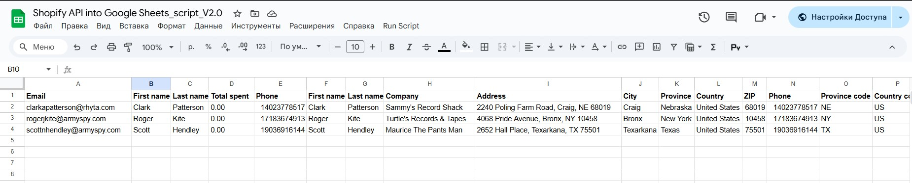

<h1>📄 Shopify → Google Sheets Customer Import</h1>
<h3>Automated Customer Sync via Google Apps Script</h3>

  This project provides a Google Apps Script function that fetches customer data from the Shopify Admin API 
  and writes it directly into a Google Sheets document.  
  It is designed for automating e-commerce reporting, CRM synchronization, analytics dashboards, or data exports.

<h2>📌 Features</h2>
<ul>
  <li>Fetches customer data from Shopify Admin API (<code>/customers.json</code>)</li>
  <li>Authenticates using a private Shopify Access Token</li>
  <li>Parses JSON and structures data for spreadsheet output</li>
  <li>Clears the target sheet before each update</li>
  <li>Writes header columns automatically</li>
  <li>Extracts customer profile and address details</li>
  <li>Auto-resizes columns for clean formatting</li>
  <li>Ready for scheduled automation via Triggers</li>
</ul>

<h2>🧩 How It Works</h2>

The <code>getCustomers()</code> function:

<ul>
  <li>Sends an authenticated GET request to Shopify Admin API.</li>
  <li>Parses the JSON response containing customer data.</li>
  <li>Clears the <strong>Customers</strong> sheet and writes a header row.</li>
  <li>Iterates through all customers and writes their details to the sheet.</li>
  <li>Formats the sheet by bolding headers and auto-resizing columns.</li>
</ul>

<h2>📊 Data Fields Imported</h2>

The script retrieves and writes the following:

<ul>
  <li>Email</li>
  <li>First name / Last name</li>
  <li>Total spent</li>
  <li>Phone</li>
</ul>

<strong>Address information:</strong>

<ul>
  <li>First name / Last name</li>
  <li>Company</li>
  <li>Address</li>
  <li>City</li>
  <li>Province / Province code</li>
  <li>Country / Country code / Country name</li>
  <li>ZIP</li>
  <li>Phone</li>
</ul>

<h2>🚀 Installation &amp; Setup</h2>

Follow these steps to set up and run the script.

<h3>1️⃣ Create a Google Spreadsheet</h3>
<ul>
  <li>Open <strong>Google Sheets</strong>.</li>
  <li>Create a new document.</li>
  <li>Add a sheet named <strong>Customers</strong> — this will store the data.</li>
</ul>

<h3>2️⃣ Open Google Apps Script</h3>
<ul>
  <li>Navigate to: <strong>Extensions → Apps Script</strong></li>
  <li>Delete any default code.</li>
  <li>Paste the script into the editor.</li>
</ul>

<h3>3️⃣ Insert Your Shopify Access Token</h3>

In Shopify admin:

<ul>
  <li>Apps → Develop apps → Your App → Configuration → Admin API scopes</li>
  <li>Ensure the scope <code>read_customers</code> is enabled.</li>
  <li>Copy your Admin API Access Token.</li>
</ul>

Replace this value in the script:

<pre><code>'X-Shopify-Access-Token': 'YOUR_TOKEN'
</code></pre>

<h3>4️⃣ Set Your Shopify Store Domain</h3>

Update the API URL:

<pre><code>let url = "https://YOUR_STORE.myshopify.com/admin/api/2023-01/customers.json";
</code></pre>

<h3>5️⃣ Authorize Script Permissions</h3>

On first run, Google will request permission to:

<ul>
  <li>Access your spreadsheet</li>
  <li>Send external requests (<code>UrlFetch</code>)</li>
</ul>

Allow all required scopes.

<h3>6️⃣ Run the Script</h3>
<ul>
  <li>Select the function <code>getCustomers</code>.</li>
  <li>Click <strong>Run</strong>.</li>
  <li>Customer data will populate the <strong>Customers</strong> sheet.</li>
</ul>

<h3>🎥 Screencast Demo</h3>

  

  👉 Click the screenshot to watch the full screencast.

