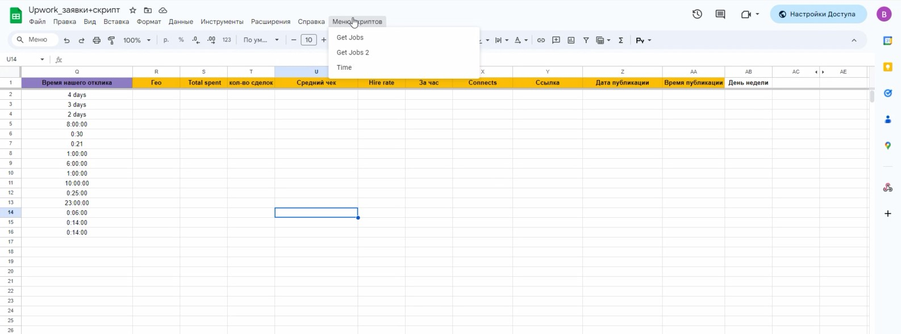

  <h1>Upwork Jobs Importer — Google Apps Script</h1>

  

    This project contains Google Apps Script utilities that automate importing job details from <strong>Upwork</strong> into a <strong>Google Spreadsheet</strong>.
    The script reads job URLs from the sheet, extracts the job key, queries the Upwork API, and writes structured job data into row fields.
    A second script refreshes the Upwork OAuth access token on a daily schedule using a refresh token.
  

  <h2>Features</h2>

  <h3>1. <code>getjobs()</code> — Main Upwork Job Importer</h3>
  <ul>
    <li>Reads Upwork job URLs from <strong>column E</strong>.</li>
    <li>Extracts the job key from URLs (the part after <code>/jobs/</code>).</li>
    <li>Sends an authorized GET request to the Upwork Jobs API:
      <pre><code>https://www.upwork.com/api/profiles/v1/jobs/{job_key}.json</code></pre>
    </li>
    <li>Writes job data into specific spreadsheet columns:
      <ul>
        <li>job title</li>
        <li>description</li>
        <li>client country</li>
        <li>total client spend</li>
        <li>number of hires</li>
        <li>creation date / time</li>
        <li>calculated average check</li>
      </ul>
    </li>
    <li>Applies conditional formatting: business days highlighted <strong>green</strong>, weekends <strong>red</strong>.</li>
  </ul>

  <h3>2. <code>requestAccessToken()</code> — OAuth Token Refresher</h3>
  <ul>
    <li>Uses <code>refresh_token</code> to obtain a new <code>access_token</code> and <code>refresh_token</code>.</li>
    <li>Updates the <code>admin</code> sheet automatically.</li>
    <li>Intended to run daily via a Google Apps Script trigger.</li>
    <li>Token endpoint:
      <pre><code>https://www.upwork.com/api/v3/oauth2/token</code></pre>
    </li>
  </ul>

  <h2>Requirements</h2>
  <ul>
    <li>Upwork account with a registered OAuth application.</li>
    <li><strong>Client ID</strong>, <strong>Client Secret</strong>, and a valid <strong>refresh_token</strong>.</li>
    <li>Google Spreadsheet with:
      <ul>
        <li>a sheet for job URLs (the script uses the active sheet)</li>
        <li>a sheet named <code>admin</code> with the following cells:</li>
      </ul>
    </li>
  </ul>

  <table aria-label="admin cells">
    <thead>
      <tr><th>Cell</th><th>Meaning</th></tr>
    </thead>
    <tbody>
      <tr><td><code>admin!A1</code></td><td>access_token</td></tr>
      <tr><td><code>admin!A2</code></td><td>refresh_token</td></tr>
    </tbody>
  </table>

  
Update these fields inside <code>requestAccessToken()</code> before running:

  <pre><code>let clientId = 'CLIENT_ID';
let clientSecret = 'CLIENT_SECRET';
let redirectUri = 'https://script.google.com/macros/d/YOUR_ID/usercallback';</code></pre>

  <h2>Spreadsheet Column Structure</h2>
  
Below is the exact layout used by the script:

  <table aria-label="column structure">
    <thead>
      <tr><th>Column</th><th>Index</th><th>Purpose</th></tr>
    </thead>
    <tbody>
      <tr><td>A</td><td>1</td><td>Script counter (i)</td></tr>
      <tr><td>E</td><td>5</td><td>User input — Upwork job URL</td></tr>
      <tr><td>Y</td><td>25</td><td>Temporary: extracted job key</td></tr>
      <tr><td>F</td><td>6</td><td>Job Title</td></tr>
      <tr><td>G</td><td>7</td><td>Job Description</td></tr>
      <tr><td>R</td><td>18</td><td>Client Country</td></tr>
      <tr><td>S</td><td>19</td><td>Total Client Spend</td></tr>
      <tr><td>T</td><td>20</td><td>Total Hires</td></tr>
      <tr><td>U</td><td>21</td><td>Average Check (Spend / Hires)</td></tr>
      <tr><td>Z</td><td>26</td><td>Job creation date</td></tr>
      <tr><td>AA</td><td>27</td><td>Job creation time</td></tr>
      <tr><td>AB</td><td>28</td><td>Day of week (<code>=TEXT(Zi, "dddd")</code>)</td></tr>
      <tr><td>AD</td><td>30</td><td>Time fragment from Upwork timestamp</td></tr>
    </tbody>
  </table>

  <h2>How to Install</h2>

  <h3>1. Prepare the Google Sheet</h3>
  <ol>
    <li>Create at least two sheets:
      <ul>
        <li><strong>Main sheet</strong> — where links are entered</li>
        <li><strong>admin</strong> — for storing tokens</li>
      </ul>
    </li>
    <li>Fill token cells:
      <pre><code>admin!A1 — access_token
admin!A2 — refresh_token</code></pre>
    </li>
  </ol>

  <h3>2. Add the Script</h3>
  <ol>
    <li>Open Google Sheets → <strong>Extensions → Apps Script</strong>.</li>
    <li>Paste both functions (<code>getjobs</code> and <code>requestAccessToken</code>).</li>
    <li>Insert your Upwork credentials (Client ID / Secret / redirectUri).</li>
    <li>Save the project.</li>
  </ol>

  <h3>3. Grant Permissions</h3>
  
On the first run Google will request:

  <ul>
    <li>Spreadsheet read/write access</li>
    <li>External API access (<code>UrlFetchApp</code>)</li>
  </ul>
  
<strong>Approve</strong> the requested permissions to allow the script to work.

  <h3>4. Set Up Triggers</h3>
  
Go to: <em>Extensions → Apps Script → Triggers</em>

  <ul>
    <li>Create a <strong>daily trigger</strong> → run <code>requestAccessToken()</code>.</li>
    <li>Optional: create a manual or scheduled trigger to run <code>getjobs()</code>, or run it manually when needed.</li>
  </ul>

  

    <strong>Security note:</strong> Do not commit Client ID / Client Secret / access tokens to a public repository.
    Consider using Script Properties or a secure secret management approach if you plan to publish your project.
  

<h3>🎥 Screencast Demo</h3>

  

  👉 Click the screenshot to watch the full screencast.

