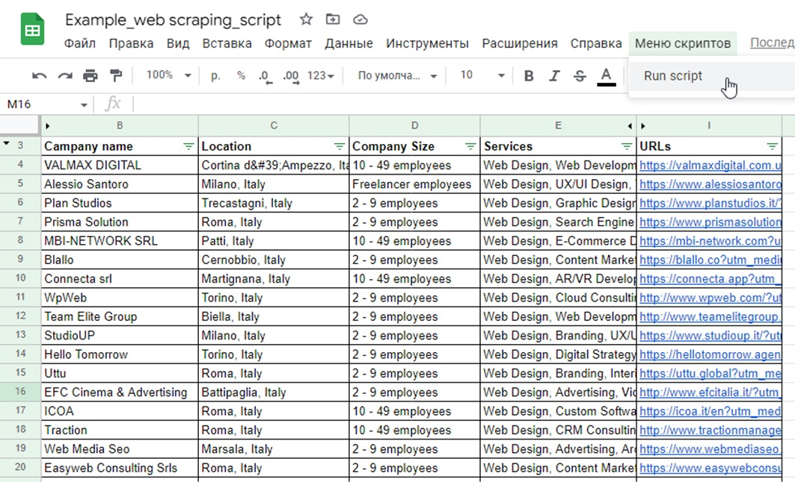

<h1>Google Apps Script — Fast Scraper for Google Sheets</h1>

<h2>Short Description</h2>

This <strong>Google Apps Script</strong> automates scraping supplier (or job) cards from a website and exports the data into Google Sheets.  
In a single run, the script can extract up to 500 items in about 30 seconds, each containing multiple fields 
(company name, location, size, services, link, etc.).  
This is useful for business directories, job aggregators, and similar catalog services.

<h2>What the Script Does</h2>
<ul>
  <li>Takes URL(s) from cells on the sheet in the active spreadsheet.</li>
  <li>Sends HTTP requests to the catalog pages (the first page and a series of subsequent pages).</li>
  <li>Searches for HTML blocks with the <code>provider_card</code> class (supplier cards).</li>
  <li>For each card, extracts: company name, location, size, list of services, and profile link.</li>
  <li>Writes the extracted data into Google Sheets in predefined rows and columns.</li>
  <li>Adds a menu item <strong>Script Menu → Run script</strong> for launching the script from the spreadsheet interface.</li>
</ul>

<h2>Requirements and Sheet Setup</h2>
<ul>
  <li>Create a sheet named <strong>Atlanta</strong> in Google Sheets.</li>
  <li>Place the first base URL in cell <strong>A1</strong> (e.g., the main catalog page).</li>
  <li>Place the URL template for subsequent pages in cell <strong>B1</strong> (for example <code>https://example.com/page/</code>).  
      The script will append page numbers (1..12).</li>
  <li>The script writes HTTP response codes to <strong>B2</strong> and <strong>A2</strong> for monitoring.</li>
  <li>Data is written starting from rows <strong>4</strong> and <strong>54</strong> — this separates the first-page batch from the remaining batches.</li>
</ul>

<em>Note: if the website’s HTML structure or class names differ, you will need to adjust the selectors manually — but modifying the script is not allowed in this task.</em>

<h2>How to Run</h2>
<ol>
  <li>Open Google Sheets → <strong>Extensions → Apps Script</strong>.</li>
  <li>Paste the script into the project (in a .gs file) and save it.</li>
  <li>Return to the spreadsheet and reload the page — a new menu item <strong>Script Menu</strong> will appear.</li>
  <li>Click <strong>Script Menu → Run script</strong>.</li>
</ol>

The script will start fetching data and filling the spreadsheet.

<h3>🎥 Screencast Demo</h3>

  

  👉 Click the screenshot to watch the full screencast.

