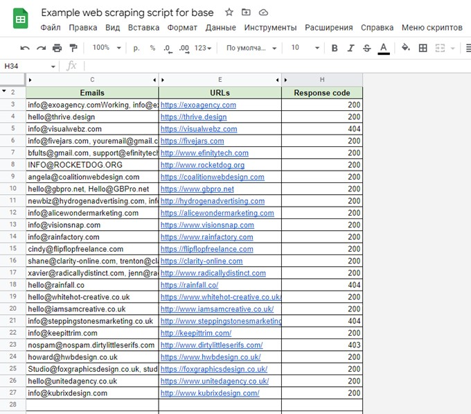

<h1>Google Apps Script: Email Scraper for Google Sheets</h1>

  <h2>Project name</h2>
  
<strong>Email Finder (Google Apps Script)</strong>

  <h2>Short description</h2>
  

    A lightweight Google Apps Script that crawls company web pages listed in a Google Sheet, 
    extracts email addresses from each page, removes duplicates, and writes the unique emails back 
    into the sheet (one cell per company, comma-separated). Designed as a simple portfolio project 
    to demonstrate automation with Google Sheets and <code>UrlFetchApp</code>.
  

  <h2>Features</h2>
  <ul>
    <li>Reads URLs from a dedicated sheet.</li>
    <li>Fetches each page (with <code>muteHttpExceptions</code> to avoid hard failures).</li>
    <li>Extracts email addresses using a regular expression.</li>
    <li>Removes duplicate email addresses found on the same page.</li>
    <li>Writes unique email addresses into the corresponding row in the sheet (one cell, comma-separated).</li>
    <li>Writes HTTP response code into an adjacent column for quick diagnosis.</li>
  </ul>

  <h2>Sheet layout (expected)</h2>
  
The script expects a Google Sheet named <strong>Emails</strong> with columns used like this:

  <ul>
    <li><strong>Column E (5)</strong> — URL to fetch</li>
    <li><strong>Column F (6)</strong> — used for starting row index (cell F1) and for writing HTTP status</li>
    <li><strong>Column A (1)</strong> — destination for unique extracted emails</li>
  </ul>
  

    The script assumes a starting row index in <strong>F1</strong> (row 1, column 6). 
    It iterates from that row to the last row.
  

  <h2>How to install / run</h2>
  <ol>
    <li>Open your Google Sheets file (create one if needed).</li>
    <li>Create a sheet named <strong>Emails</strong>.</li>
    <li>Put your list of company URLs into <strong>column E</strong> (one URL per row).</li>
    <li>Put the starting row number into <strong>cell F1</strong> (e.g., <code>2</code> if row 1 contains headers).</li>
    <li>Open <strong>Extensions → Apps Script</strong> in the spreadsheet.</li>
    <li>Create a new script file and paste the script.</li>
    <li>Save and run the function <code>getEmailsFromPage()</code> (Google will ask for script permissions).</li>
    <li>Check <strong>column A</strong> for found emails and <strong>column F</strong> for response codes.</li>
  </ol>

  <h2>Usage notes & limitations</h2>
  <ul>
    <li>
      The script uses a simple regex to find email-like patterns. It will detect typical emails but may 
      capture false positives (e.g., obfuscated or unusual formats).
    </li>
    <li>
      The script fetches raw HTML and does not execute JavaScript, so emails rendered dynamically on the client side may not be found.
    </li>
    <li>Respect robots.txt and the terms of service of target websites.</li>
    <li>
      For large volumes of URLs, consider Google Apps Script quotas (execution time, URL fetch limits).
    </li>
    <li>The script writes the HTTP status code to column F for easier debugging.</li>
  </ul>

  <h2>Example</h2>
  
<strong>Emails sheet example:</strong>

  <ul>
    <li><strong>E2:</strong> https://example.com</li>
    <li><strong>F1:</strong> 2</li>
  </ul>

  

    After running, <strong>A2</strong> may contain: 
    <code>info@example.com, sales@example.com</code> 
    <strong>F2</strong> will contain: <code>200</code> (HTTP status code)
  

<h3>🎥 Screencast Demo</h3>

  

  👉 Click the screenshot to watch the full screencast.

