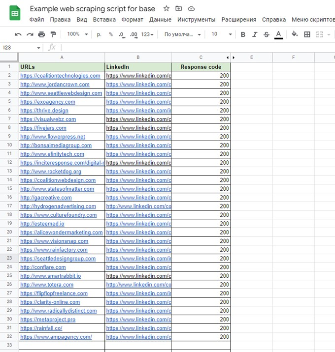

<h1>LinkedIn Links Collector — Google Apps Script</h1>

  This Google Apps Script scans a list of company websites stored in a Google Sheet, fetches each page, 
  and extracts LinkedIn profile links found on the page (both company and profile types). The script writes 
  unique links into the corresponding row next to the company URL and records the HTTP response code. 
  It's a lightweight tool for quickly collecting LinkedIn links for a portfolio, lead generation, 
  or data-entry automation.

<h2>Main Features</h2>
<ul>
  <li>Reads company URLs from a sheet named <strong>LinkedIn</strong>.</li>
  <li>Fetches page content with <code>UrlFetchApp.fetch</code> and stores the HTTP response code.</li>
  <li>Uses a regex to find <code>linkedin.com/in/...</code> and <code>linkedin.com/company/...</code> links.</li>
  <li>Removes duplicates and writes a comma-separated list of unique links to the sheet.</li>
  <li>Easy to configure — put URLs in column A and run the function.</li>
</ul>

<h2>Recommended Sheet Layout</h2>
<ul>
  <li><strong>Column A</strong> — Company URL (website URL)</li>
  <li><strong>Column B</strong> — LinkedIn Links (comma-separated results)</li>
  <li><strong>Column C</strong> — HTTP Code (HTTP response code)</li>
  <li><strong>Column D</strong> — Start row / counter (the script reads starting row from D2)</li>
</ul>

<h2>Limitations & Notes</h2>
<ul>
  <li>The sheet must be named <strong>LinkedIn</strong>. The starting row for processing is read from cell D2 (usually 2).</li>
  <li>If a page is unreachable or fetch throws an exception, the HTTP code cell is left blank or contains a space.</li>
  <li>
    The regex used is simple and may not cover edge cases 
    (links with query parameters, localized paths, redirects, or links rendered by JavaScript). 
    For robust parsing, consider an HTML parser or server-side crawler.
  </li>
  <li>Be aware of Google Apps Script quotas when fetching many pages.</li>
</ul>

<h2>Usage (How to Run)</h2>
<ol>
  <li>Open a Google Sheet and create a sheet named <strong>LinkedIn</strong>.</li>
  <li>In Column A, paste the list of company website URLs.</li>
  <li>In cell <strong>D2</strong>, enter <strong>2</strong> (or the desired starting row).</li>
  <li>In the Google Apps Script editor, insert the <code>getLinkedInLinks()</code> function and save the project.</li>
</ol>

<h3>🎥 Screencast Demo</h3>

  

  👉 Click the screenshot to watch the full screencast.

